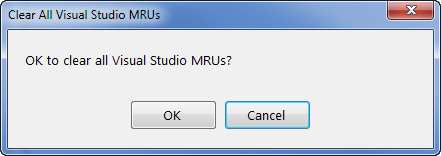

# VsClearMrus

This Microsoft Window's mini-application is used for easily clearing the MRU 
(Most Recently Used) lists inside Visual Studio.

For example:

    	1) 'Recent Projects and Solutions' menu item values
    	2) 'Find and Replace' dialog drop-down list values
    	3) etc...

Launching this application results in the following dialog:

Clicking the __OK__ button will clear all MRUs in all supported versions of Visual Studio*.  
Clicking the __Cancel__ button dismisses the dialog.  
In either case the application is subsequently exited.

\* This application currently supports only Visual Studio IDE versions 2008 through 2015.  
Visual Studio 2017 and 2019 support will be added in an upcoming release.